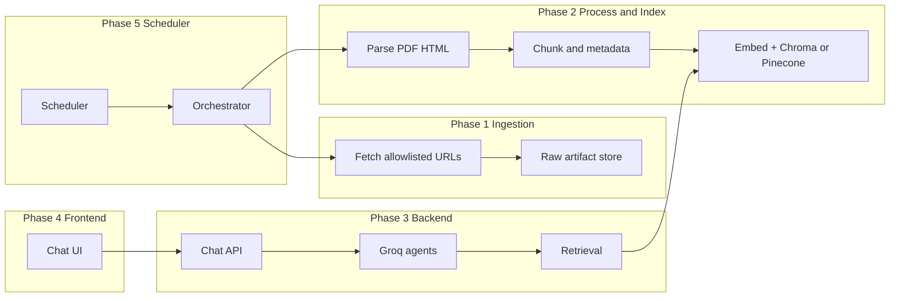
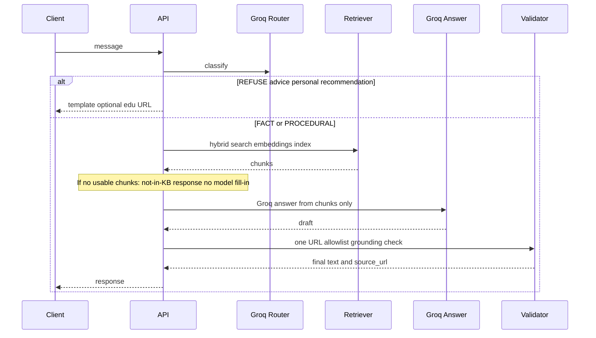
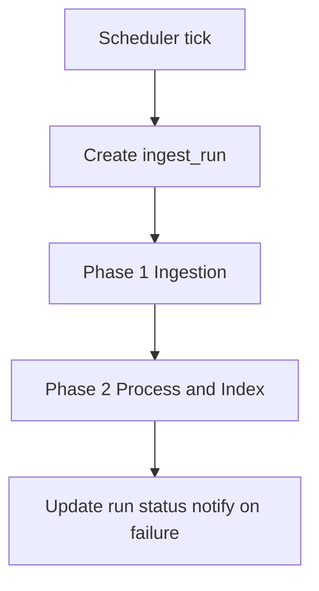

# RAG architecture — Mutual Fund facts-only FAQ chatbot

This document describes a **five-phase** end-to-end architecture: data ingestion, processing & indexing, **backend with Groq-powered agents**, **frontend** chat application, and a **scheduler** that periodically refreshes data and drives the pipeline so retrieval always targets the latest indexed content.

**Deployment is out of scope** here; components are defined logically so they can run locally, in CI, or on any cloud later.

**LLM:** All generative steps (routing copy, answer drafting, optional rewrites) use **[Groq](https://groq.com/)** via its OpenAI-compatible API. Groq is the **only** production LLM in this architecture; do not substitute an ungrounded model path for user-facing answers.

---

## Product constraints (recap)

| Rule | Implementation hook |
|------|----------------------|
| **Factual chatbot** | Scope limited to verifiable fund / regulatory / procedural facts from approved sources; tone is informational, not persuasive |
| **Answers must come from the index (embeddings / retrieval)** | The assistant **must not** answer from the model’s own knowledge. **Always** run retrieval against the vector (+ lexical) index; pass **only** retrieved chunks into the answer step. If retrieval is empty or below a confidence threshold, return a fixed “not in knowledge base” / pointer to official documents—**never** invent or complete gaps from parametric memory |
| Facts only (expense ratio, exit load, min SIP, lock-in, riskometer, benchmark, statement / CG download help) | Intent router + refusal paths; prompts |
| **Exactly one** `source_url` per assistant turn | Post-validator on model output; fallback to top chunk’s `canonical_url` |
| No investment advice / comparisons / portfolio / “what should I buy” | Router → `REFUSE_ADVICE` (or equivalent); short template stating out of scope + one educational allowlist link |
| **No personal information** | Do not collect, infer, or discuss user PII (PAN, holdings, income, tax situation, account details). If asked, refuse: out of scope; no personalization |
| **No recommendations** | Treat “recommend”, “best fund”, “where should I invest”, stock tips, or portfolio construction as **out of scope**; same refusal path as advice |
| Sources | Seed scheme pages, AMC (factsheet, KIM, SID), AMFI, SEBI, RTA guides |

---

## System context



---

## Phase 1 — Data ingestion

**Purpose:** Pull the latest allowlisted content into a **raw artifact store** (immutable blobs + metadata).

**Inputs**

- Seed scheme URLs (e.g. indmoney scheme pages) and configured AMC / AMFI / SEBI / RTA URL lists  
- `schemes` / `document_artifacts` registry (see `DATA_SCHEMA.md`)

**Steps**

1. Resolve target URLs per `artifact_id` (or discover new PDF links from hub pages).  
2. HTTP fetch with rate limiting; respect `robots.txt` and terms of use.  
3. Store bytes with `content_hash`, `mime_type`, `fetched_at`, `ingest_run_id`.  
4. Upsert `document_versions` rows; link to `ingest_run_sources` outcomes.

**Outputs**

- New or updated `document_versions` with `parser_status = pending`  
- `ingest_run` record for downstream phases

**Technology (suggested):** Python workers, object storage or filesystem, Postgres for metadata.

**Implemented in this repo:** Code is split by phase under top-level folders:

| Phase | Path | Run |
|-------|------|-----|
| **1** Ingestion | `phase1/src/mf_ingest/` | `mf-ingest run` (or `python -m mf_ingest run` with `pip install -e .`) |
| **2** Index | `phase2/src/mf_index/` | Install vectors: `pip install -e '.[vector]'`. Then `mf-index build --run-id <ingest_run_id>` with `--backend chroma` (default) or `--backend pinecone` → `chunks.jsonl`, `index_manifest.json`, and either local **Chroma** (`chroma_db/`) or **Pinecone** (namespace = ingest run id). |
| **3** Chat API | `phase3/src/mf_chat/` | `mf-chat` → `POST /api/chat` returns `answer` + `source_urls` |
| **4** Frontend | `phase4/web/chat.html` | Open in browser while Phase 3 is running |
| **5** Orchestration | `phase5/src/mf_pipeline/` | `mf-pipeline` (ingest then index) |

From the project root, after `pip install -e .` (and `pip install -r requirements.txt` if you use it), Phase 1 writes `data/raw/<ingest_run_id>/*.html`, `data/manifests/<ingest_run_id>.json`, and structured `data/processed/<ingest_run_id>/*.json`. IndMoney often serves a Cloudflare challenge to plain HTTP—use `mf-ingest run --browser` (requires optional `playwright` + `playwright install chromium`) or save HTML from the browser and run `mf-ingest import-html saved.html --source-url <canonical page URL>`.

---

## Phase 2 — Processing & indexing

**Purpose:** Turn processed artifacts into **chunks** with rich metadata, compute **dense embeddings**, upsert into a **vector database**, and keep an auditable **chunk store** for full text and citations.

**Steps**

1. **Parse:** (In this repo, Phase 1 already produced structured JSON from HTML; PDF pipeline can follow the same chunk contract later.)  
2. **Chunk:** Semantic / section-aware segments from processed JSON; attach `scheme_id` (when present in `__NEXT_DATA__`), `doc_type` (`indmoney_scheme`), `canonical_url` / `source_url`, `chunk_id`, `kind`.  
3. **Embed:** Batch embeddings via **[sentence-transformers](https://www.sbert.net/)** (default **`sentence-transformers/all-MiniLM-L6-v2`**, dimension **384**, L2-normalized for cosine similarity).  
4. **Index (vector DB):** Upsert vectors plus minimal metadata into either:  
   - **[Chroma](https://www.trychroma.com/)** — `PersistentClient` under `data/index/<ingest_run_id>/chroma_db/`; one collection per run (`mf_rag_<ingest_run_id>` with `-` → `_`). Cosine space.  
   - **[Pinecone](https://www.pinecone.io/)** — serverless or pod index; **namespace = `ingest_run_id`** so multiple ingest runs share one physical index safely. Requires `PINECONE_API_KEY`; index name from `PINECONE_INDEX` (default `mf-rag`). **The Pinecone index must be created with dimension 384** (or whatever embedding model you configure) and a compatible metric (e.g. cosine).  
5. **Chunk audit file:** Write `data/index/<ingest_run_id>/chunks.jsonl` (full `text` per `chunk_id`). Vector rows reference `chunk_id`; Phase 3 loads full text from this file after similarity search so Pinecone metadata size limits are not an issue.  
6. **Manifest:** Write `index_manifest.json` (`backend`, paths / index name / namespace, embedding model, dimension). Phase 3 uses it to choose Chroma vs Pinecone and the same embedding model for queries.  
7. **Hybrid retrieval:** Vector top-`N` from the store, then a **light lexical re-score** on the shortlist (optional **BM25** / full hybrid search can replace this later).  
8. **Delta / deactivate (future):** Full rebuild on each `mf-index build` today; production can restrict embed+upsert to changed `version_id`s and tombstone old chunk IDs.

**CLI (implemented)**

```bash
pip install -e ".[vector]"
mf-index build --run-id <ingest_run_id>                    # default --backend chroma
mf-index build --run-id <ingest_run_id> --backend pinecone  # set PINECONE_API_KEY, PINECONE_INDEX
mf-pipeline ... --index-backend chroma|pinecone
```

**Outputs**

- `chunks.jsonl` + `index_manifest.json` + Chroma directory **or** Pinecone vectors  
- Vectors keyed by `chunk_id`; metadata includes `source_url`, `scheme_name`, `kind`, `scheme_id` (stringified where required by the store)

**Technology in this repo:** Chroma **or** Pinecone (config via `--backend`); **sentence-transformers** for embeddings; lexical re-rank in `mf_index.retrieval`. Older indexes with only `chunks.jsonl` and no manifest still work via pure lexical retrieval in Phase 3 until rebuilt.

---

## Phase 3 — Backend (API + Groq agents + retrieval)

**Purpose:** Expose a **chat HTTP/WebSocket API** that orchestrates **Groq** (sole LLM) for classification and **strictly retrieval-grounded** answer drafting: a **factual** chatbot that **never** substitutes general model knowledge for indexed content, and **refuses** personal-data and recommendation / advice questions.

### 3.1 Service responsibilities

| Component | Role |
|-----------|------|
| **Chat controller** | Auth (optional), session/conversation ids, rate limits |
| **Scheme resolver** | Map names → `scheme_id` (registry + fuzzy match); disambiguation responses |
| **Retriever** | Hybrid search over **embedded chunks** + metadata filters + top-k + optional rerank; **mandatory** before any factual answer |
| **Grounding gate** | If no chunks (or scores below threshold), **do not** call Answer agent to “fill in”; return refusal / “not available in indexed documents” |
| **Post-validator** | Ensures exactly one allowlisted URL in user-facing reply; answer text must not introduce facts absent from retrieved chunks |

### 3.2 Groq agent usage

Use **[Groq](https://groq.com/)** OpenAI-compatible API for low-latency inference. Split work into **focused agent steps** (single API calls or short graphs), not one monolithic prompt:

| Agent / step | Model role | Input | Output |
|----------------|------------|-------|--------|
| **Router agent** | Classification + extraction | User message + short history | JSON: `intent` (`FACT_SCHEME`, `FACT_GENERAL`, `PROCEDURAL`, `REFUSE_ADVICE`, `REFUSE_PERSONAL`, `REFUSE_OUT_OF_SCOPE`, …), `scheme_guess`, `fact_keys[]` |
| **Answer agent** | **Grounded** generation only | **Retrieved chunks only** (trimmed), user question, citation rules, “use no other knowledge” | Draft answer + proposed `source_url` |
| **Refusal agent** (optional; can be template) | Short polite decline | Detected `REFUSE_*` (advice, personal data, recommendations, chit-chat) | Fixed template + optional one educational URL from allowlist |

**Guidelines**

- **Router** and **Answer** should use instruction-tuned models available on Groq (e.g. Llama 3.x / Mixtral class) per your latency/quality tradeoff.  
- **Non‑negotiable:** The Answer agent receives **only** text from the embedding index (retrieved chunks). System prompts must state that **parametric knowledge is forbidden** for factual claims; paraphrasing and structuring retrieved text is allowed.  
- **No retrieval → no fabricated answer:** If the retriever returns nothing useful, skip grounded generation of fund facts; respond with a standard out-of-corpus message (and optional link to AMFI / scheme document types).  
- **Out of scope:** Questions asking for **personal information** (e.g. “what is my…”, KYC, account data) or **recommendations** (“best fund for me”, “should I buy…”) are routed to refusal; the bot does not answer them as a factual lookup.  
- Implement **post-validation** in code: count URLs; if ≠ 1, retry once with a stricter prompt or set `source_url` from the highest-ranked chunk’s `canonical_url` and strip extra links from body; optionally verify salient numbers/strings appear in retrieved span.

**Optional tool-calling (“agent”) pattern on Groq**

- Expose a tool `search_knowledge_base(query, scheme_id?, doc_type?)` that runs your retriever; the model **must** rely on tool results (embeddings-backed index) before asserting facts. Keep **max tool rounds** small to control latency. If the tool returns no rows, the model should **not** answer from memory.

### 3.3 Request flow



### 3.4 Persistence

- Append `messages`; store `retrieved_chunk_ids`, `intent`, `model_id` for audit (see `DATA_SCHEMA.md`).

---

## Phase 4 — Frontend chat application

**Purpose:** A **web (or mobile) UI** for the **factual**, **index-grounded** FAQ experience (no advice or personal-data UX expectations), with clear sourcing and compliance copy.

### 4.1 Features

| Area | Behavior |
|------|----------|
| **Chat thread** | User/assistant bubbles; streaming optional (SSE/WebSocket from backend) |
| **Source** | Prominent single link per assistant message (`source_url`); open in new tab |
| **Disclaimers** | Static footer: facts only, not investment advice |
| **Refusals** | Same UI as normal replies; show educational link |
| **Scheme picker** (optional) | When resolver confidence is low, suggest disambiguation list from backend |

### 4.2 API integration

- `POST /api/chat` (or `/v1/chat/completions` shim) with `{ conversation_id?, message }`  
- Render `answer` + `source_url`; hide secondary links if backend ever sends them in prose (backend should not)

### 4.3 Tech (suggested)

- React/Next.js or Vue/Svelte SPA; or mobile with same contract  
- Accessible components, loading states, error toasts for API failures

---

## Phase 5 — Scheduler & pipeline orchestration

**Purpose:** Run on a **schedule** (e.g. daily/weekly) so **Phase 1** always pulls the latest documents, then **automatically triggers Phase 2** (and any downstream hooks) so the chatbot’s index stays current **without manual steps**.

### 5.1 Orchestration flow

1. **Trigger:** Cron (e.g. `cron` on VM, Kubernetes `CronJob`, GitHub Actions scheduled workflow, or Celery beat / APScheduler).  
2. **Create `ingest_run`** with `trigger = scheduler`.  
3. **Run Phase 1** for all configured sources (or delta URLs).  
4. On Phase 1 completion (success or partial): **enqueue Phase 2** for all new/changed `version_id`s.  
5. **Phase 2** completes → mark run `success` / `partial`; optional notifications on failure.  
6. **Phase 3** needs **no restart** if index is hot-updated; if you cache schema in memory, trigger a soft refresh.



### 5.2 Failure handling

- **Per-URL failures:** logged in `ingest_run_sources`; do not block entire run if policy allows partial success.  
- **Phase 2 failure:** retain previous index generation for affected artifacts if you use blue/green chunk sets; otherwise rollback flag per `artifact_id`.  
- **Alerting:** webhook/email/Slack on repeated failures (implementation-specific).

### 5.3 Manual runs

- Admin endpoint or CLI: same orchestrator with `trigger = manual` for on-demand refresh after adding a new scheme URL.

### 5.4 Implemented daily schedule (12:00 local)

This repo includes **`scripts/run_daily_pipeline.sh`** (runs `mf-pipeline`) plus **macOS `launchd`** and **cron** examples under `deploy/`. Step-by-step setup: **[SCHEDULER.md](./SCHEDULER.md)**.

---

## Consolidated phase summary

| Phase | Name | Delivers |
|-------|------|----------|
| **1** | Data ingestion | Fresh raw artifacts + `document_versions` |
| **2** | Processing & indexing | Chunks, embeddings, **Chroma or Pinecone** vector index + manifest + lexical re-rank |
| **3** | Backend + Groq agents | Chat API; Groq-only LLM; **retrieval-mandatory** factual answers; refusals for advice / personal / recommendations |
| **4** | Frontend | Chat UI, source link UX, disclaimers |
| **5** | Scheduler & orchestration | `mf-pipeline` CLI + optional daily job (see [SCHEDULER.md](./SCHEDULER.md)) |

---

## Security & compliance (brief)

- Allowlist outbound fetch domains; allowlist citation URLs in the validator.  
- **PII and personalization:** The chatbot is **not** designed to handle or return personal information; router refusals and logging must avoid storing sensitive user data in prompts where possible.  
- No PII required for FAQ mode; if you add auth, store minimal identifiers.  
- Log retention policy for `messages` / `llm_calls` per internal policy.

---

## Related document

- **[DATA_SCHEMA.md](./DATA_SCHEMA.md)** — tables, enums, chat DTOs, pipeline job fields.

---

*Groq is a third-party API; model names and availability change—pin versions in config and re-run evaluation when upgrading.*
